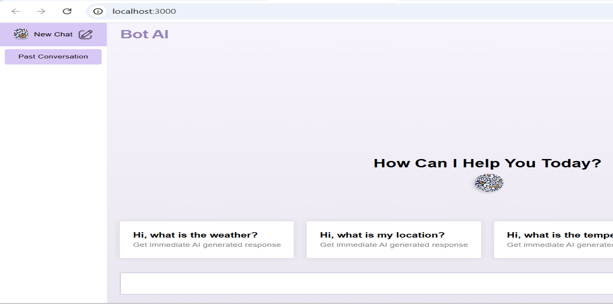

# BotAI-Chatbot

## The App

**Code-A-Thon Project:** A ReactJS web application that allows users to chat with an AI model and provide feedback on the responses. The application offers multiple conversation threads, allows for ratings, and provides an easy-to-navigate interface to view past conversations and feedback.

## Features

- **Chat Interface**: Users can engage in conversations with a mock AI model.
- **Feedback Mechanisms**:
  - Like/Dislike buttons appear on hover over AI responses.
  - A rating system (out of 5) at the end of each conversation.
  - Option for users to leave subjective feedback.
- **Conversation History**: Users can revisit past chats and view feedback associated with them.
- **Feedback Overview**: Users can filter and sort feedback based on ratings.
- **Light/Dark Mode**: Users can toggle between light and dark themes.
- **Responsive Design:**: The application is fully responsive, adapting to various screen sizes.

## Getting Started

### Prerequisites

Make sure you have the following installed on your machine:

- `Node.js`
- `npm`

## Technologies Used

- `HTML`
- `CSS`
- `JavaScript`
- `React.js`
- `React Router DOM`

## NPM Libraries Used

- `Material UI`
- `Axios`

## Demo

- [Click here for the demo](https://bot-ai-chatbot-7dd7co8vt-indra-reddys-projects.vercel.app)
